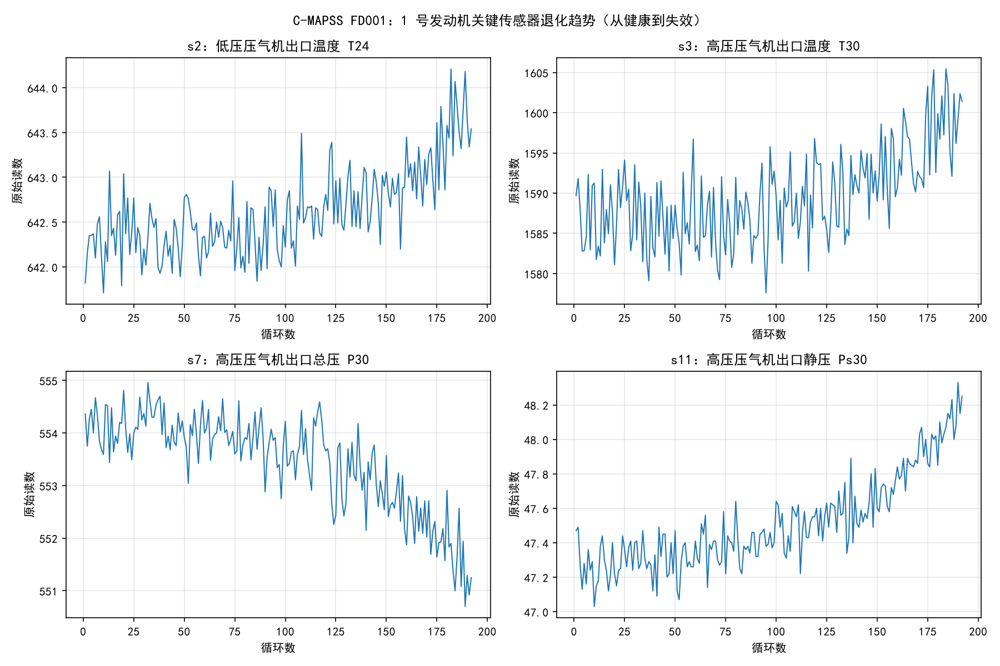

# 数据说明

## 数据来源

本项目使用 NASA **C-MAPSS** 涡扇发动机退化仿真数据集的 **FD001** 子集（公开数据集，非自建）。

- 数据集介绍页（NASA Prognostics Data Repository 第 6 项）：
  https://www.nasa.gov/intelligent-systems-division/discovery-and-systems-health/pcoe/pcoe-data-set-repository/
- 实际下载地址（NASA 官方直链已失效，本项目从 GitHub 开源镜像获取，内容一致）：
  https://github.com/mapr-demos/predictive-maintenance/tree/master/notebooks/jupyter/Dataset/CMAPSSData
- 引用文献：Saxena A, Goebel K, et al. Damage propagation modeling for aircraft engine run-to-failure simulation. PHM 2008.

## 原始文件（本目录下）

| 文件 | 内容 | 用途 |
|---|---|---|
| `train_FD001.txt` | 100 台发动机完整寿命数据（20631 行 × 26 列） | 训练模型 |
| `test_FD001.txt` | 100 台设备中途数据（13096 行 × 26 列） | 模拟在役设备，系统演示 |
| `RUL_FD001.txt` | test 集 100 台设备的真实剩余寿命 | 验证预测精度 |

数据格式：空格分隔、无表头，每行 26 列 = unit（设备编号）+ cycle（循环数）+ setting1~3（工况参数）+ s1~s21（21 个传感器）。

## 数据长什么样

以 1 号发动机为例，关键传感器随循环数的退化趋势（`algorithms/plot_sensors.py` 生成）：

可以看到：随着设备退化，温度类传感器（s2、s3、s11）读数上升，压力类（s7）下降——这正是用机器学习预测剩余寿命的依据。

## 预处理后文件（`processed/` 子目录）

由 `algorithms/import_data.py` 生成，预处理内容：剔除 7 个恒定传感器列（s1/s5/s6/s10/s16/s18/s19）→ min-max 归一化（参数用 train 集拟合，存于 `backend/models/scaler.pkl`）→ 训练集构造 RUL 标签（最大循环数 − 当前循环数，截断 125）。

| 文件 | 内容 |
|---|---|
| `processed/train_clean.csv` | 预处理后的训练数据（20631 行：unit + cycle + 14 个归一化传感器 + rul 标签） |
| `processed/test_clean.csv` | 预处理后的在役设备数据（13096 行：unit + cycle + 14 个归一化传感器，无标签） |

## 数据库

原始 test 集数据同时导入 SQLite（`data/app.db`，由 `import_data.py` 生成，不上传仓库）：`equipment` 表 100 台设备台账、`sensor_data` 表 13096 行传感器数据。
