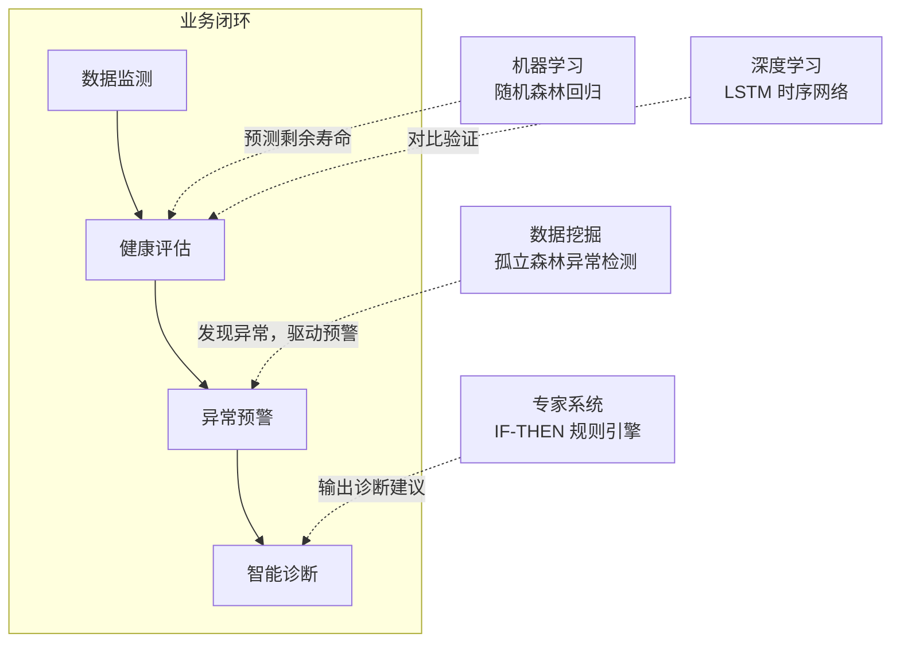

# 选题说明

## 一、拟定题目

**工业设备智能运维与预测性维护平台**

## 二、完成目标

工厂里的设备维修，以前基本是两种办法：坏了才修（事后维修），或者到时间就修（定期维修）。前者停机损失大，后者容易修过头或者没修够。现在比较先进的做法是预测性维护：根据设备的传感器数据判断健康状况，提前预测还能用多久，在出故障之前安排维修。我这次课设就想围绕这个场景做一个完整的系统。

数据方面，我选用 NASA 公开的 C-MAPSS 涡扇发动机退化数据集（FD001 子集），里面有 100 台发动机从健康跑到失效的传感器记录，是预测性维护领域常用的基准数据。

系统做成 B/S 架构，在一台个人电脑上就能跑起来，最终要实现这样一条完整的业务闭环：

拆开来就是五件事：

1. **设备台账管理**：把数据集中的 100 台发动机作为设备导入系统，可以增删改查；
2. **数据监测**：选一台设备，用图表展示它各路传感器数据随时间的变化趋势，有异常的点标红；
3. **健康评估**：点一下按钮，系统调用训练好的模型算出这台设备还剩多少寿命（RUL），并给出 0~100 的健康度评分；
4. **异常预警**：检测到传感器数据异常，或者预测寿命低于阈值时，系统自动生成一条预警记录；
5. **诊断与工单**：对预警点"智能诊断"，系统给出怀疑的故障部位和排查维修建议，然后一键生成维修工单，工单可以流转状态（待处理 → 维修中 → 已完成）。

整个系统包含前端页面、后端接口、数据库和算法模块四部分，最后能现场完整演示一遍上面的流程，并配有自动化测试。

## 三、涉及的技术方向

本系统用到了课程的 **4 个技术方向**（要求至少 3 个），每个方向都在业务流程里干实际的活，不是摆设：

| 课程技术方向 | 具体用的方法 | 在系统里负责什么 |
|---|---|---|
| **机器学习** | 随机森林回归（Random Forest） | 健康评估的主力模型：把传感器最近一段时间的数据提取成统计特征，预测剩余寿命 RUL |
| **深度学习** | LSTM 长短期记忆网络 | 从时间序列角度建模设备退化过程，和随机森林的预测结果做对比 |
| **专家系统** | IF-THEN 规则推理（自建 15~30 条规则库） | 智能诊断：根据"哪些传感器异常 + 剩余寿命多少"，推出疑似故障部位和分层排查建议 |
| **数据挖掘** | 孤立森林（Isolation Forest）异常检测，配合 3σ 规则 | 从监测数据里自动找出异常点，触发预警生成 |

这四个方向在系统里是串起来的：**异常检测先发现问题 → RUL 预测评估问题严不严重 → 规则引擎给出怎么修的建议 → 工单把维修执行闭环掉**。

对应关系如下图：

